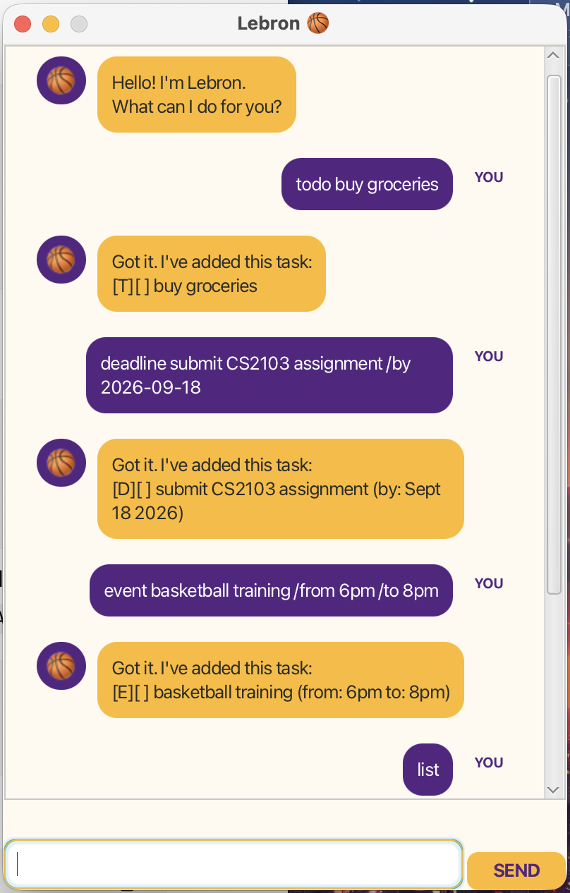
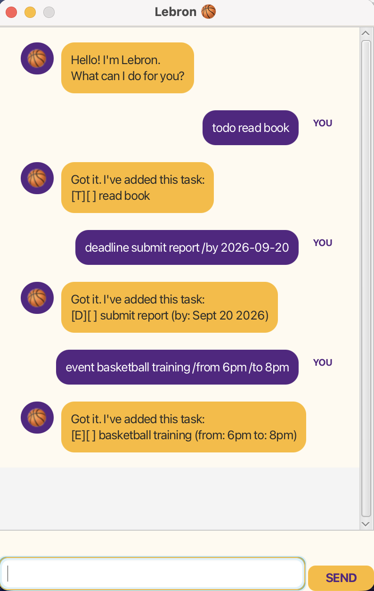
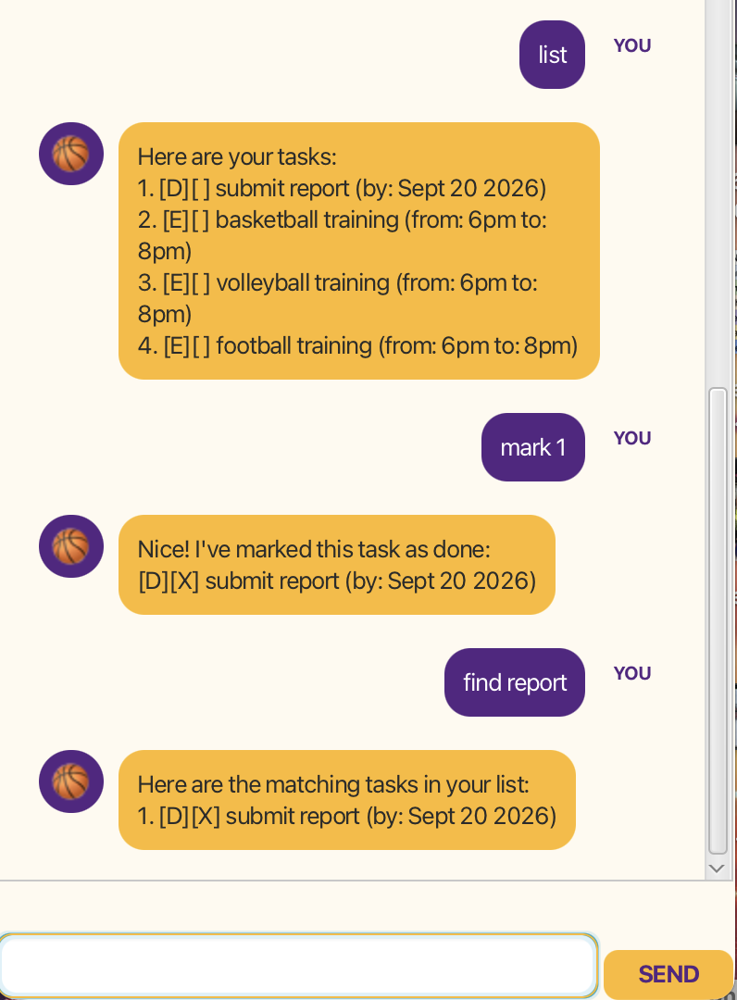
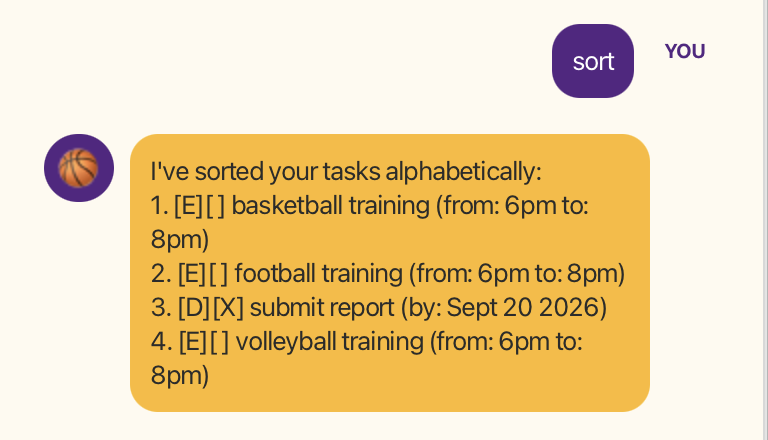
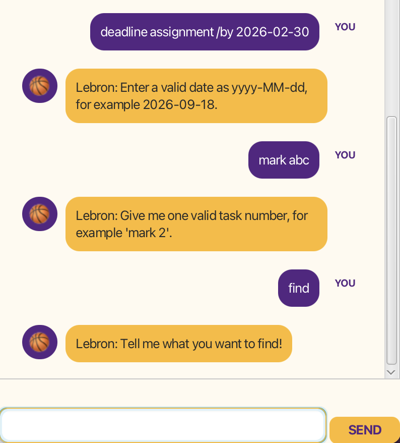

# Lebron User Guide 🏀

Lebron is a task-management chatbot that helps you manage todos, deadlines, and events through a simple JavaFX chat interface.

<p align="center">
  
</p>

## Quick Start

1. Launch Lebron.
2. Type a command into the input box at the bottom of the window.
3. Press **Enter** or click **SEND**.
4. Type `bye` when you are finished.

---

## Adding todos

Adds a task that does not have a specific date or time.

Format:

`todo DESCRIPTION`

Example:

`todo read book`

Expected output:

```text
Got it. I've added this task:
[T][ ] read book
```

---

## Adding deadlines

Adds a task that must be completed by a specified date.

Format:

`deadline DESCRIPTION /by YYYY-MM-DD`

Example:

`deadline submit assignment /by 2026-09-18`

Expected output:

```text
Got it. I've added this task:
[D][ ] submit assignment (by: Sep 18 2026)
```

Dates must be entered in the `yyyy-MM-dd` format.

---

## Adding events

Adds an event with a start and end time.

Format:

`event DESCRIPTION /from START /to END`

Example:

`event basketball training /from 6pm /to 8pm`

Expected output:

```text
Got it. I've added this task:
[E][ ] basketball training (from: 6pm to: 8pm)
```

<p align="center">
  
</p>

---

## Viewing all tasks

Displays all tasks currently stored in Lebron.

Format:

`list`

Example output:

```text
Here are your tasks:
1. [T][ ] read book
2. [D][ ] submit assignment (by: Sep 18 2026)
3. [E][ ] basketball training (from: 6pm to: 8pm)
```

---

## Marking a task as done

Marks a task as completed using its task number.

Format:

`mark TASK_NUMBER`

Example:

`mark 1`

Expected output:

```text
Nice! I've marked this task as done:
[T][X] read book
```

Use `list` first if you are unsure of the task number.

---

## Deleting a task

Deletes a task using its task number.

Format:

`delete TASK_NUMBER`

Example:

`delete 1`

Expected output:

```text
Alright, I've removed this task:
[T][ ] read book
```

Lebron will also display how many tasks remain after the task is deleted.

---

## Finding tasks

Finds tasks whose descriptions contain the specified keyword.

Format:

`find KEYWORD`

Example:

`find assignment`

Example output:

```text
Here are the matching tasks in your list:
1. [D][ ] submit assignment (by: Sep 18 2026)
```

The search is case-insensitive.

<p align="center">
  
</p>

---

## Sorting tasks

Sorts all tasks alphabetically according to their descriptions.

Format:

`sort`

Example output:

```text
I've sorted your tasks alphabetically:
1. [E][ ] basketball training (from: 6pm to: 8pm)
2. [T][ ] read book
3. [D][ ] submit assignment (by: Sep 18 2026)
```

<p align="center">
  
</p>

---

## Error handling

Lebron provides clear feedback when a command is incomplete or invalid.

For example, entering:

`deadline assignment /by 2026-02-30`

will result in:

```text
Lebron: Enter a valid date as yyyy-MM-dd, for example 2026-09-18.
```

Entering:

`mark abc`

will result in:

```text
Lebron: Give me one valid task number, for example 'mark 2'.
```

Entering:

`find`

will result in:

```text
Lebron: Tell me what you want to find!
```

<p align="center">
  
</p>

---

## Exiting Lebron

Closes the application.

Format:

`bye`

Expected output:

```text
That's game. See you next time!
```

---

## Saving data

Lebron automatically saves your tasks after changes such as:

- adding tasks
- deleting tasks
- marking tasks as done
- sorting tasks

Your saved tasks are loaded automatically the next time you start Lebron.

If the data file does not exist, Lebron creates a new one automatically.

Malformed saved entries are ignored instead of causing the application to crash.

---

## Command Summary

| Action | Command |
| --- | --- |
| Add todo | `todo DESCRIPTION` |
| Add deadline | `deadline DESCRIPTION /by YYYY-MM-DD` |
| Add event | `event DESCRIPTION /from START /to END` |
| View tasks | `list` |
| Mark task | `mark TASK_NUMBER` |
| Delete task | `delete TASK_NUMBER` |
| Find task | `find KEYWORD` |
| Sort tasks | `sort` |
| Exit | `bye` |